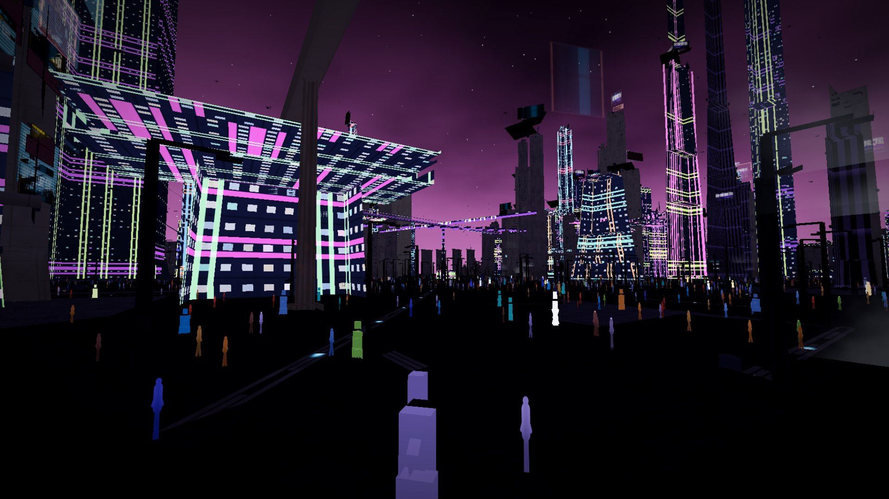
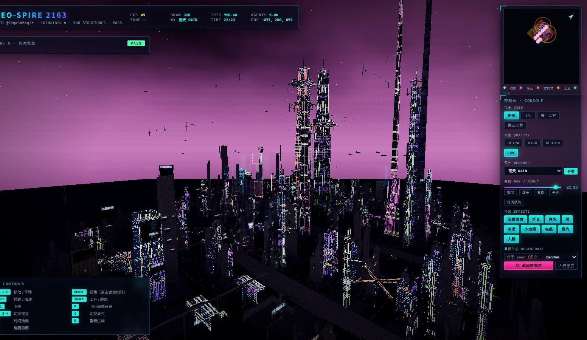
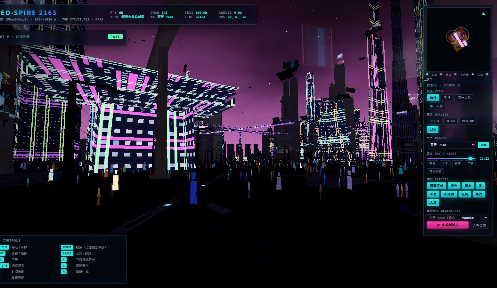
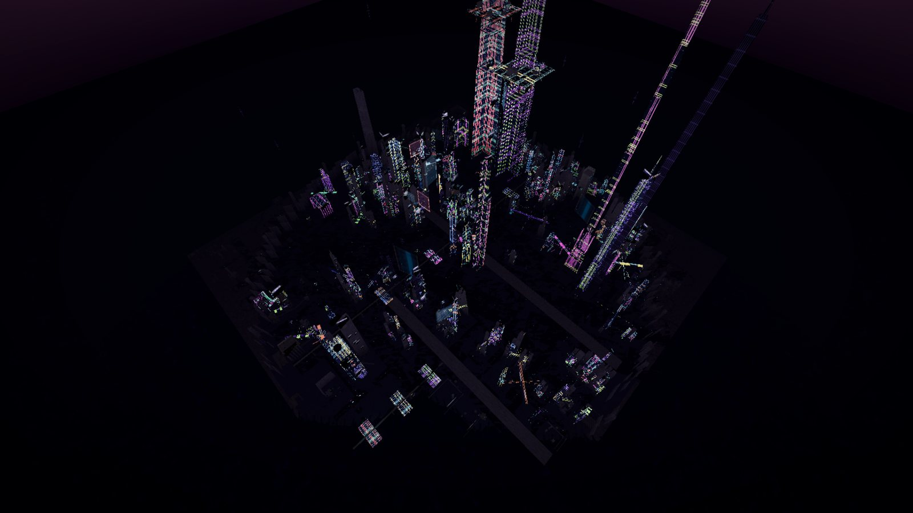
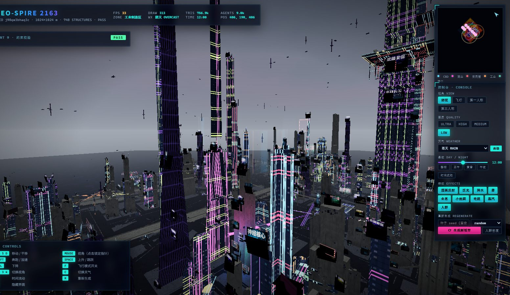
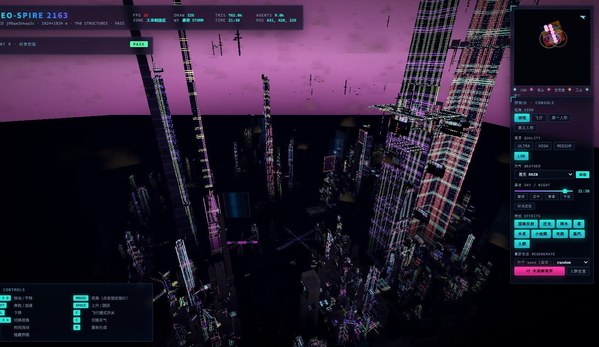
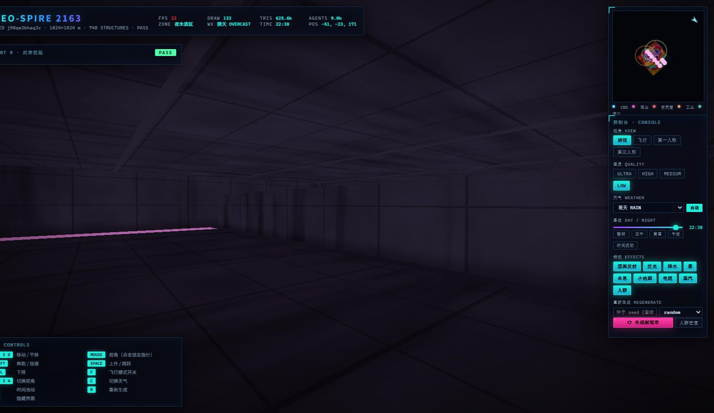
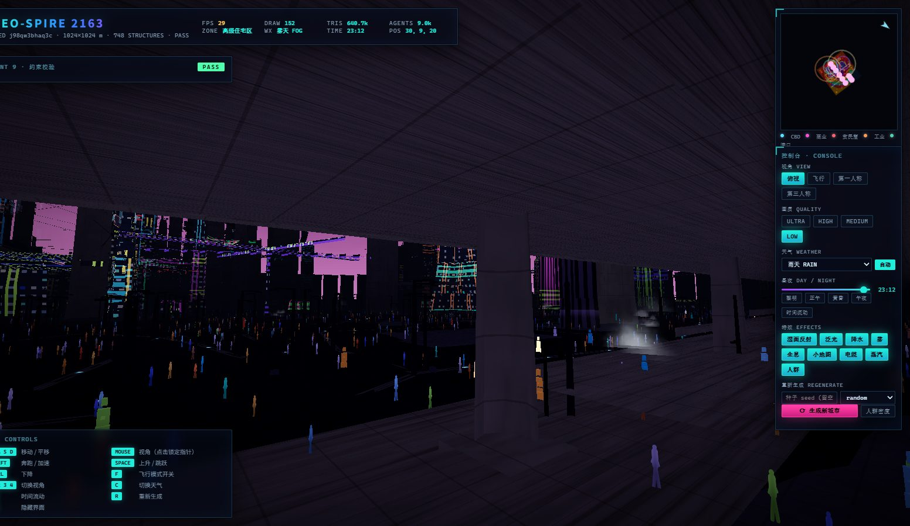
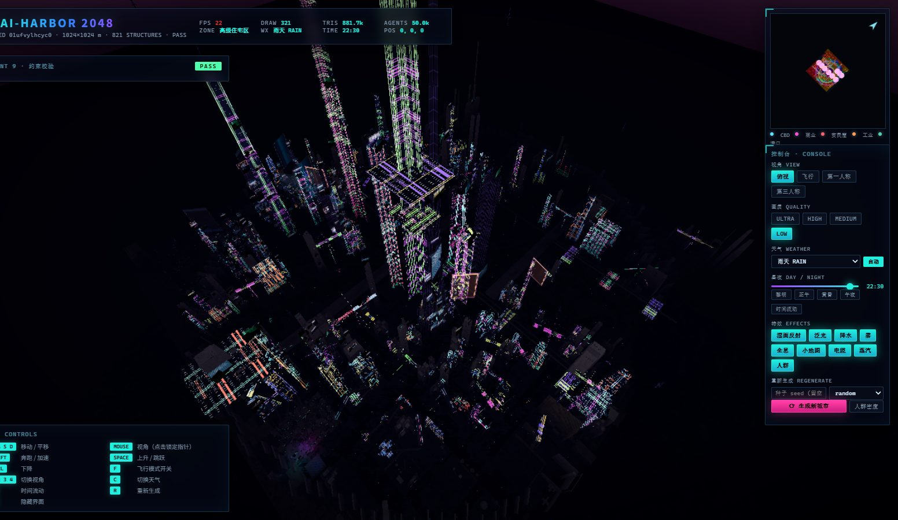
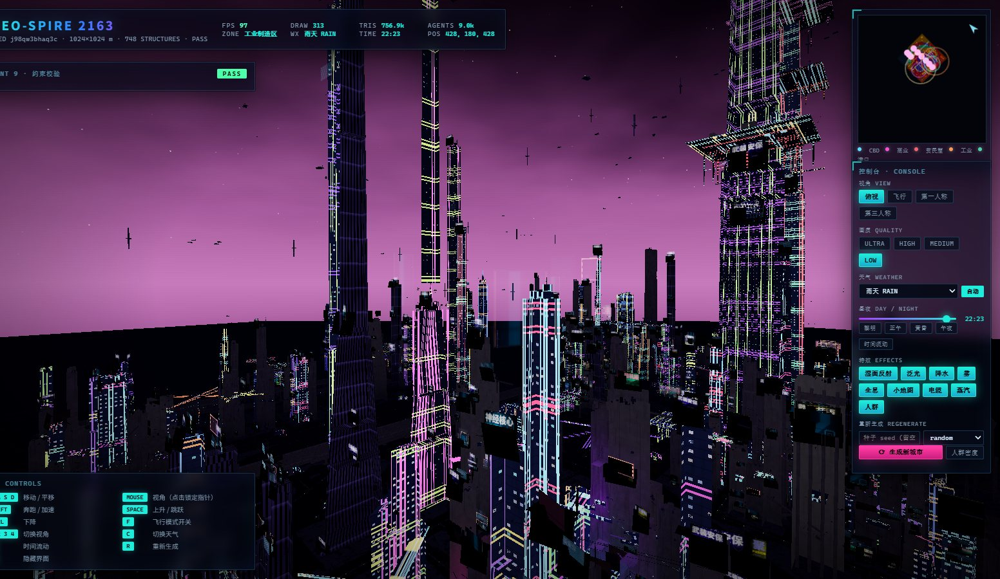

<div align="center">

# NEO-KOWLOON

**程序化赛博朋克超级都市生成器**
**Procedural Cyberpunk Mega-City Generator**

一座公元 2080–2150 年间的未来超级都市，完全由代码生成 —— 每次都不同。

[](https://darling-y1230.github.io/cyberpunk-city-generator/)
[](../../releases/latest)

[](LICENSE)
[](https://threejs.org)
[](#运行要求)
[](#五--嵌进已有网页)
[](docs/ARCHITECTURE.md#10-the-two-headless-test-harnesses)
[](CONTRIBUTING.md)



<sub>雨夜街道 · 湿沥青反射、霓虹幕墙、横跨街道的天桥 —— 全部实时渲染，无预渲染素材</sub>

</div>

---

## 这是什么

一个跑在浏览器里的 **程序化城市生成器**。它不是把方块堆成城市 —— 它把真实城市规划学写成了算法。

整座城市由 **十个阶段的生成管线** 从零合成：地形与海岸线、竞价地租驱动的功能分区、
三级路网、建筑与超级企业版图、立体交通、灯光、广告、五万人口的 GPU 人群、环境细节，
最后是约束校验与几何压缩。

**每次刷新都是一座不同的城市。** 而每一座都满足同一套硬约束：16 个功能区齐备、
路网无断裂、无穿模、无漂浮建筑、每商业街区 ≥5 块广告牌、霓虹色比符合规格。

最终产物是 **一个 962 KB 的 HTML 文件** —— 双击就能玩，不需要联网、不需要装任何东西。

<table>
<tr>
<td width="50%"><br><sub><b>天际线</b> · 逐段退台的超高层 · 企业总部光带</sub></td>
<td width="50%"><br><sub><b>街景</b> · 立体广告墙 · 中文/日文/韩文招牌</sub></td>
</tr>
<tr>
<td><br><sub><b>俯视</b> · 真实路网层级与街区肌理</sub></td>
<td><br><sub><b>日照</b> · 同一座城市的白天</sub></td>
</tr>
<tr>
<td><br><sub><b>暴雨</b> · 天气真正改变雾、反射与能见度</sub></td>
<td><br><sub><b>地下城区</b> · 隧道、黑市、数据交易中心</sub></td>
</tr>
<tr>
<td><br><sub><b>夜生活区</b> · 摊位、全息与动态灯牌</sub></td>
<td><br><sub><b>50 000 名市民</b> · 位置全部由顶点着色器解算</sub></td>
</tr>
</table>



<sub>从城市边缘俯瞰：塔楼群、空中航线、无人机航道，以及自然衰减的城市边界</sub>

---

## 快速开始

### 一 · 直接双击（最简单）

下载 [`dist/cyberpunk-city.html`](dist/cyberpunk-city.html) —— **962 KB，双击即可**。
不需要 Node，不需要服务器，不需要联网。

> 微信 / QQ 会拦截 `.html` 附件：压成 zip 发，或改名 `.html.txt` 让对方改回来。

### 二 · 在线试玩

**<https://darling-y1230.github.io/cyberpunk-city-generator/>**

### 三 · 从源码构建

```bash
git clone https://github.com/Darling-Y1230/cyberpunk-city-generator.git
cd cyberpunk-city-generator
node tools/fetch-deps.mjs      # three.js + esbuild，一条命令
node tools/build.mjs           # -> dist/cyberpunk-city.html
node tools/serve.mjs           # -> http://127.0.0.1:8173
```

只需要 **Node 20+**。整个项目不涉及任何包管理器 —— 依赖直接用 Node 自带的
`fetch` 从 npm registry 拉取，用随仓库分发的 esbuild 打包。

### 四 · 局域网共享（同一 WiFi）

```bash
npm run serve
```
```
  local      http://127.0.0.1:8173/
  LAN        http://192.168.86.6:8173/     <-- 把这一行发出去
```

### 五 · 嵌进已有网页

```html
<iframe src="cyberpunk-city.html"
        style="width:100%;height:100vh;border:0"
        allow="fullscreen; pointer-lock"></iframe>
```

跨源必须写 `allow="pointer-lock"`，否则锁不住鼠标，第一/第三人称视角用不了。
纯展示可以加参数：`?nohud=1&mode=fly&weather=rain&t=22.4`

---

## 操作

| 按键 | 作用 |
|---|---|
| `W A S D` | 移动 / 平移 |
| 鼠标 | 视角（点击画面锁定指针，`Esc` 解锁） |
| `Shift` | 奔跑 / 加速 |
| `Space` / `Ctrl` | 上升 / 下降 |
| `F` | 飞行模式开关 |
| `1` `2` `3` `4` | 俯视 / 飞行 / 第一人称 / 第三人称 |
| `C` | 切换天气 · `L` 时间流动 · `R` 重新生成 · `H` 隐藏界面 |

### URL 参数

```
?seed=neo-2087     固定随机种子（同种子 = 同一座城市）
?size=2048         强制地图尺寸 512 / 1024 / 2048
?mode=fly          初始视角 topdown | fly | fps | tps
?weather=storm     初始天气 clear | overcast | rain | storm | fog | acid | dust
?t=23.5            初始时刻 0–24
?q=ultra           画质 ultra | high | medium | low
?nohud=1           隐藏界面（截图用）
```

---

## 它生成什么

### 十六个功能区 —— 一个都不少

| 地面分区 | 立体分区 |
|---|---|
| 中央商务区 · 超级企业总部区 · 高科技研发区 · 工业制造区 | **空中城区** —— 悬挑平台、空中住宅、企业专属区，全部由塔楼核心的柱与斜撑承托 |
| 港口物流区 · 普通住宅区 · 高级住宅区 · 贫民窟 | **地下城区** —— 黑市、非法实验室、数据交易中心、地下酒吧、义体诊所、神龛、垂直农场，由竖井通向地面路口 |
| 娱乐商业区 · 夜生活区 · 医疗中心区 · 教育科研区 | |
| 数据中心区 · 能源供应区 | |

**分区不是撒点，是求解。** 地价场 = 到 CBD 的负指数衰减 + 多核心可达性 + 滨水溢价 − 邻避效应；
每个用途提交一条**竞价曲线**竞争每一格土地，再由多数滤波使边界连续。
所以工业自然落在下风口和滨水，贫民窟自然占据最便宜的地，高级住宅自然拿到景观。
详见 [docs/PIPELINE.md](docs/PIPELINE.md)。

### 三级路网

**大道**（6–12 车道，笔直贯穿全城）→ **支路**（连接各区，允许弯曲）→ **密集小巷**（狭窄复杂，霓虹密布）。

路网是一段**分割史**：先切出大道，再切支路，最后切小巷 —— 街道等级由"切割发生时地块有多大"决定。
切割线始终贯穿父地块，因此**任何街道端点必然落在另一条街上，断路在结构上不可能出现**。
新切割会吸附到既有的共线街道上，所以大道能笔直延伸几公里而不是逐块错位。

### 立体交通

高架公路、磁悬浮轨道（含车站与列车）、空中出租车航线（100–500 m）、无人机航道（30–96 m）、
步行天桥、企业专属空中通道。所有高架元素都锚定在已有结构上 —— 高架桥墩落在道路格上，
天桥只连接真实存在的两栋建筑，空中平台与塔楼核心重叠并由柱子承托。**没有东西悬空。**

### 灯光 / 广告 / 人口 / 环境

- **灯光** —— 95% 人工光源。一万七千个发光体注册进光池，每帧只把离相机最近的 12 个上传给着色器逐像素计算。
  霓虹色比蓝 35 / 紫 25 / 青 20 / 粉 15 / 红 5 由**洗牌袋**保证，而不是独立加权抽样。
- **广告** —— 整个广告网络是一张 6×4 的程序化图集（中日韩文案、产品图形、价签、条形码、CRT 扫描线），
  **项目里没有任何图片文件**。每块广告牌是一个实例；含 LED 板、日式竖招牌、加法混合全息、投影。
- **人口** —— 1 000–50 000 名市民，13 种职业。位置全部由顶点着色器从烘焙好的路径纹理解算，
  **CPU 每帧不接触任何一个智能体**。
- **环境** —— 电缆、空调外机、管线、蒸汽、监控摄像头、垃圾、路边摊、自动售货机、脚手架、水洼、
  雨、雾、酸雨、沙尘、闪电。

---

## 生成管线

| # | Agent | 文件 | 产物 |
|---|---|---|---|
| 01 | 地形与区域规划 | `src/gen/planner.js` | 高程、海岸线、地价场、14 个地面分区 |
| 02 | 道路网络 | `src/gen/roads.js` | 三级路网、路口、连通性审计 |
| — | 地表与路面 | `src/gen/ground.js` | 车行道、人行道、斑马线、荒地、海面、码头 |
| 03 | 建筑布局 | `src/gen/buildings.js` | 地块 + 9 类形体 + 3–10 家超级企业 |
| 04 | 立体交通 | `src/gen/transit.js` | 高架、磁悬浮、天桥、航线、航道 |
| — | 立体城区 | `src/gen/vertical.js` | 空中城区、地下城区、竖井 |
| — | 城市边缘 | `src/gen/perimeter.js` | 工业废墟、隔离高墙、瞭望塔、检查站 |
| 05 | 灯光系统 | `src/gen/lighting.js` | 光源注册 + 霓虹色比 + 动态光池 |
| 06 | 广告系统 | `src/gen/ads.js` | 程序化图集 + 4 类载体 + 巨型全息 |
| 07 | NPC 系统 | `src/gen/npc.js` | GPU 路径寻走人群 + 载具 |
| 08 | 环境细节 | `src/gen/details.js` | 道具、电缆、蒸汽、粒子 |
| 09 | 约束校验 | `src/gen/validate.js` | 12 项硬约束 → PASS / CONCERNS / FAIL |
| 10 | 优化与压缩 | `src/gen/optimize.js` | 空间分块合并、实例化 |

每个阶段的输入、输出、算法与**踩过的坑**都写在 [docs/PIPELINE.md](docs/PIPELINE.md)。

---

## 实测数据

本机 Edge 无头模式（SwiftShader 软件渲染，1600×900，`high` 画质）实测：

| 地图 | 生成耗时 | 建筑 | 广告牌 | 道具 | 霓虹光源 | Draw Call | 三角面 | 校验 |
|---|---|---|---|---|---|---|---|---|
| 512² | 0.23 s | 177 | 1 351 | 1 853 | 2 352 | 242 | 0.30 M | **PASS** |
| 1024² | 0.59 s | 1 037 | 14 000 | 8 931 | 17 950 | 327 | 0.83 M | **PASS** |
| 2048² | 1.39 s | 2 451 | 27 647 | 22 729 | 35 790 | 374 | 1.73 M | **PASS** |
| 1024² + 50 000 NPC | — | — | — | — | — | 321 | 0.88 M | **PASS** |

三种尺寸、多个种子、5 万人口压力下，12 项硬约束全绿，控制台零异常。

**离线实测**（不是声称）：

```
$ node tools/verify.mjs --offline=1
network emulation: OFFLINE
"externalResources": []        ← 页面加载的外部资源数：0
"verdict": "PASS"
```

**构建可复现**：从一个干净的 checkout 重新构建，产物与仓库里提交的
`dist/cyberpunk-city.html` **逐字节相同**（SHA-256 一致）。你下载的那份文件，
就是这份源码构建出来的那份。

```
$ git checkout-index -a -f --prefix=_clean/ && cd _clean
$ node tools/fetch-deps.mjs && node tools/build.mjs
$ sha256sum dist/cyberpunk-city.html
e0abd694a3b2e561641cc1efe2f10a9a52c9d3f1d26d632c8d34e439194fa940
```

---

## 项目结构

```
cyberpunk-city/
├── index.html              开发入口（importmap → 本地 vendor/three）
├── main.js                 十阶段管线编排 + 渲染主循环
├── config.json             ★ 全部可调参数（唯一数据源）
│
├── src/
│   ├── core/               种子化随机 · 栅格/空间哈希 · 路径 · 引擎 · 相机
│   ├── gen/                十个 Agent
│   ├── world/              昼夜 · 天气 · 天穹
│   ├── ui/                 HUD · 小地图
│   └── shaders/            材质库 + 动态霓虹光池（generated.js 自动生成）
│
├── shaders/                ★ 9 个 GLSL 文件（真正使用，构建时内联）
│   common · surface · road · neon · sky · crowd · rain · particle · wire
│
├── models/                 MeshBuilder · 9 类建筑形体 · 25 种道具 · 载具
├── textures/               程序化广告图集（无图片文件）
│
├── docs/
│   ├── ARCHITECTURE.md     ★ 为什么代码是这个形状
│   ├── PIPELINE.md         ★ 十个阶段的输入/输出/算法/坑
│   ├── CONFIG.md           自动生成的 config.json 参考
│   └── img/                README 配图
│
├── tools/                  构建 · 验证 · 测试 · 本地服务器
└── dist/cyberpunk-city.html   ★ 最终交付物（单文件，离线可运行）
```

---

## 它是怎么做出来的

代码里有几处"看起来绕"的设计，都是被具体的 bug 逼出来的。完整的故事在
[docs/ARCHITECTURE.md](docs/ARCHITECTURE.md)，这里只列最关键的几条：

**所有硬约束都落在同一张栅格上。** 道路、建筑、道具、运行时碰撞、小地图全部读写同一个
`Uint8Array`。因此"建筑压在马路上"不是需要测试的 bug，而是**代码到不了的状态**。

**几何用同一套顶点语言。** 摩天楼、铁皮棚、龙门吊、自动售货机都通过 `MeshBuilder` 输出
`position / normal / uv(米) / aData / aData2`。UV 用**米**而不是 0–1，所以 4 米小巷和 12 车道大道
是同样的两个三角形，楼层层高与车道线全部由着色器从真实尺寸推导。

**色彩是线性 HDR，只在最后做一次色调映射。** 霓虹常常超过 1.0，泛光在线性空间取阈值，
最后统一走一次 ACES + sRGB。这决定了画面是"亮"还是"电影感"。

**人群是纹理查找。** 路径图烘焙进一张浮点纹理后，5 万个市民的位置完全在顶点着色器里算出来。
CPU 每帧的工作量是零。

**测试跑在 Node 里，不跑浏览器。** `tools/geom-test.mjs` 把每一个程序化网格都构建一遍并断言
坐标有限；`tools/plan-test.mjs` 跨 10 个种子 × 3 种尺寸断言 16 个功能区的最小面积契约。
两者合计约两秒。它们抓到过一个把全城建筑塌成 5 栋的变量遮蔽 bug。

---

## 运行要求

| 项目 | 要求 |
|---|---|
| 浏览器 | 桌面版 **Chrome / Edge / Firefox 110+**（Safari 未验证） |
| 图形 | 硬件加速的 **WebGL2** |
| 输入 | **鼠标 + 键盘**（WASD / 指针锁定） |
| 手机 / 平板 | ⚠️ **能看，不能玩** —— 操作依赖鼠标键盘，未做触摸适配 |

**启动时会自动探测设备能力**，不会给你一块黑屏：

- 没有可用 WebGL → 显示中文排查指引 + 探测到的诊断信息
- 检测到软件渲染（SwiftShader / llvmpipe / 虚拟机显卡）→ 自动切 `LOW` 画质并提示
- 缺浮点渲染缓冲（无法做 HDR）→ 自动关闭泛光、降级为 8 位输出，其余功能照常

---

## 已知限制

- **手机端不可玩。** 只有画面，没有触摸操作。
- **Safari 未验证。**
- 2048² 地图在纯软件光栅化下约 25–30 fps；独显上 `high` 画质流畅。

## 路线图

- [ ] 触摸操作（虚拟摇杆 + 拖拽视角 + 陀螺仪），让手机端真正可玩
- [ ] 地面交通车流（目前只有空中与轨道）
- [ ] 导出为 glTF / OBJ，供其他引擎使用
- [ ] 关键帧飞览动画与视频导出
- [ ] 自定义分区权重编辑器

## 文档

| 文档 | 内容 |
|---|---|
| [docs/ARCHITECTURE.md](docs/ARCHITECTURE.md) | 三层结构、栅格契约、分块批处理、HDR 色彩管线、为什么用保证而非修补 |
| [docs/PIPELINE.md](docs/PIPELINE.md) | 十个阶段的输入输出、算法细节、以及每个阶段踩过的坑 |
| [docs/CONFIG.md](docs/CONFIG.md) | `config.json` 全部可调项（自动生成） |
| [CONTRIBUTING.md](CONTRIBUTING.md) | 开发环境、不可协商的约束、两个容易踩的陷阱 |

## 许可

[MIT](LICENSE)。`vendor/` 内的 three.js 与 esbuild 各自遵循其 MIT 许可，且**不随仓库分发**。

---

<div align="center">
<sub>

视觉基调参考：Cyberpunk 2077 · Blade Runner 2049 · Ghost in the Shell · Akira ·
Altered Carbon · The Matrix · Observer · Ready Player One

亚洲赛博朋克增强：东京 · 香港九龙城寨 · 上海未来城 · 首尔 · 深圳

</sub>
</div>
